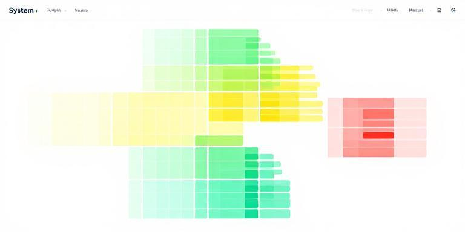

# Monitor

A real-time status dashboard that displays hierarchical system metrics as an interactive treemap visualization.

## Purpose

Monitor provides a simple way to publish and visualize system status metrics from multiple sources. Status data is published to a central pubsub server and rendered in a browser-based treemap where the size of each box represents its relative importance and colors indicate health status (green = good, yellow = warn, red = bad, gray = stale).

## Installation

No installation required. Requires Python 3 and a running pubsub server on port 19103.

## Usage

### Start the Monitoring Agent

The agent publishes system metrics (disk, memory, network) to pubsub:

```bash
./run agent
```

### View the Dashboard

Serve the UI and open it in a browser:

```bash
./run serve
```

Then navigate to `http://localhost:8090`

### Run Tests

```bash
./run test
```

## Publishing Custom Metrics

Use the Python client library to publish your own status metrics:

```python
from lib.monitor import Monitor

# Initialize with pubsub server URL and token
monitor = Monitor("http://localhost:19103", "your-token-here")

# Publish a status metric
monitor.publish(
    path="/monitor/myapp/database",
    weight=10,           # Relative size (higher = larger box)
    status="good",       # "good" | "warn" | "bad"
    name="Database",
    value="50 queries/sec",
    details="All connections healthy"
)
```

### Status Hierarchy

Organize metrics hierarchically using path segments:

```python
# Top-level service
monitor.publish("/monitor/webserver", weight=20, status="good", name="Web Server")

# Nested metrics
monitor.publish("/monitor/webserver/cpu", weight=5, status="warn", name="CPU", value="75%")
monitor.publish("/monitor/webserver/memory", weight=8, status="good", name="Memory", value="45%")
```

### Status Levels

- **good**: Green - system operating normally
- **warn**: Yellow - degraded performance or approaching limits
- **bad**: Red - critical issue requiring attention
- **stale**: Gray - no update received in 5 minutes (automatic)

## Dashboard Interaction

- **Click** any box to zoom into that subtree
- **Click background** or **Escape key** to zoom out
- **Hover** to see details tooltip
- Dashboard auto-refreshes every 2 seconds

## Examples

### Simple Health Check

```python
monitor.publish(
    path="/monitor/api",
    weight=15,
    status="good",
    name="API Server",
    value="200ms avg",
    details="99.9% uptime"
)
```

### Multi-Level System Monitoring

```python
# Disk monitoring
monitor.publish("/monitor/disks", weight=30, status="warn", name="Storage")
monitor.publish("/monitor/disks/root", weight=10, status="good", name="Root", value="45%")
monitor.publish("/monitor/disks/data", weight=20, status="warn", name="Data", value="82%")

# Network monitoring  
monitor.publish("/monitor/network", weight=15, status="good", name="Network")
monitor.publish("/monitor/network/eth0", weight=10, status="good", name="eth0", value="1.2 Gbps")
```

### Custom Application Metrics

```python
# Queue depths
monitor.publish("/monitor/queues/orders", weight=8, status="good", 
                name="Orders", value="142 pending")
monitor.publish("/monitor/queues/emails", weight=5, status="bad",
                name="Emails", value="5823 pending", details="SMTP server down")

# Cache performance
monitor.publish("/monitor/cache/redis", weight=12, status="good",
                name="Redis", value="98% hit rate")
```

## License

This project is licensed under [CC BY-NC 4.0](https://darren-static.waft.dev) - free to use and modify, but no commercial use without permission.
